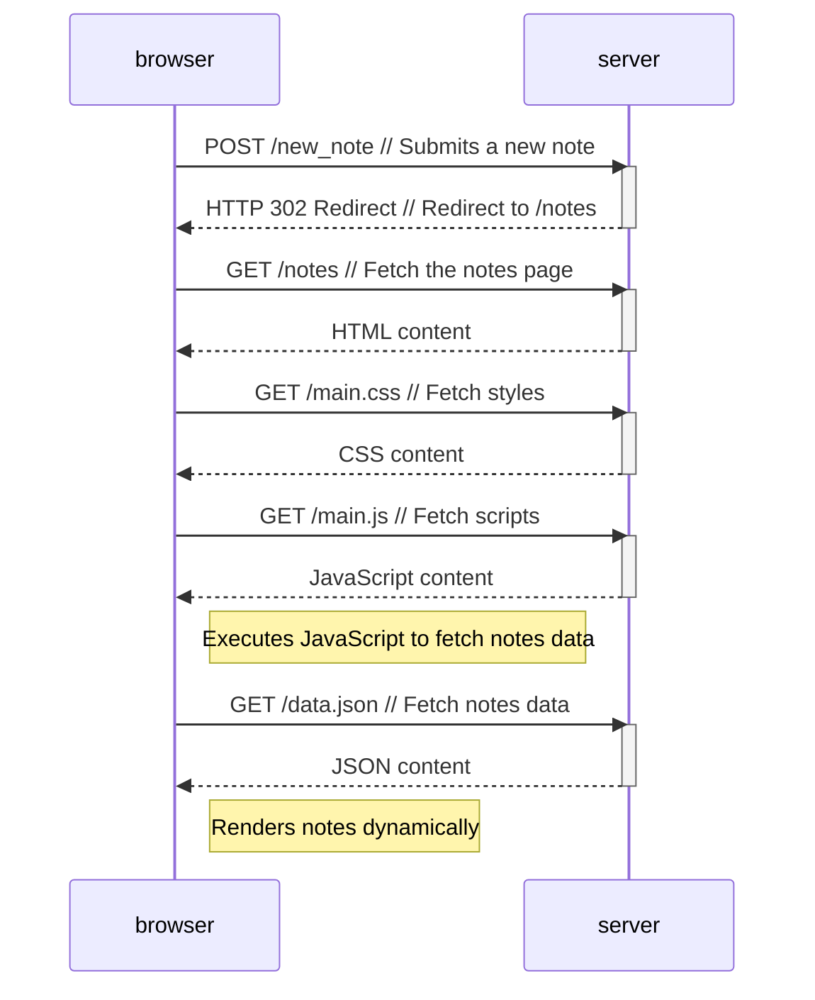

```mermaid
sequenceDiagram
participant browser
participant server

browser->>server: POST /new_note  // Submits a new note
activate server
server-->>browser: HTTP 302 Redirect  // Redirect to /notes
deactivate server

browser->>server: GET /notes  // Fetch the notes page
activate server
server-->>browser: HTML content
deactivate server

browser->>server: GET /main.css  // Fetch styles
activate server
server-->>browser: CSS content
deactivate server

browser->>server: GET /main.js  // Fetch scripts
activate server
server-->>browser: JavaScript content
deactivate server

Note right of browser: Executes JavaScript to fetch notes data

browser->>server: GET /data.json  // Fetch notes data
activate server
server-->>browser: JSON content
deactivate server

Note right of browser: Renders notes dynamically

```
