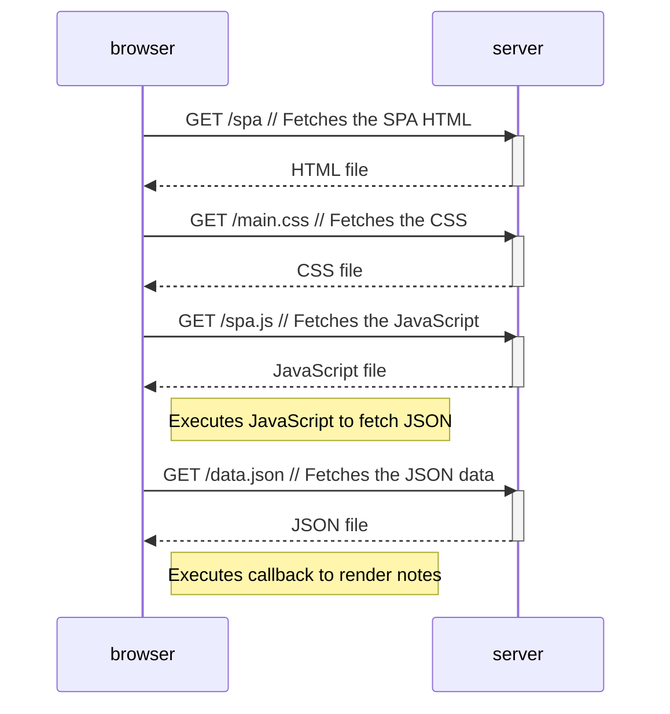

```mermaid

sequenceDiagram
participant browser
participant server

browser->>server: GET /spa  // Fetches the SPA HTML
activate server
server-->>browser: HTML file
deactivate server

browser->>server: GET /main.css  // Fetches the CSS
activate server
server-->>browser: CSS file
deactivate server

browser->>server: GET /spa.js  // Fetches the JavaScript
activate server
server-->>browser: JavaScript file
deactivate server

Note right of browser: Executes JavaScript to fetch JSON

browser->>server: GET /data.json  // Fetches the JSON data
activate server
server-->>browser: JSON file
deactivate server

Note right of browser: Executes callback to render notes

```
